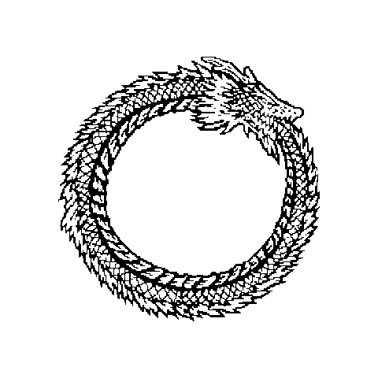

  <picture>
    <source media="(prefers-color-scheme: dark)" srcset="ouroboros-dark.gif">
    
  </picture>

<h3 align="center">break · understand · rebuild · repeat</h3>

OffSec · CTI · DevSecOps

<code>python · bash · kotlin</code> &nbsp;|&nbsp; <code>caido · frida · jadx</code> &nbsp;|&nbsp; <code>linux · docker · kvm</code>

🇧🇷

quebrar · entender · reconstruir · repetir — OffSec, CTI, DevSecOps.

<!-- TryHackMe: badge removido enquanto o S3 da THM não gera xbara0x.png
     (tryhackme-badges.s3.amazonaws.com/xbara0x.png → 403 em 2026-09-13).
     O antigo mostrava o nick XBaraoVermelhoX. Perfil: https://tryhackme.com/p/xbara0x -->
